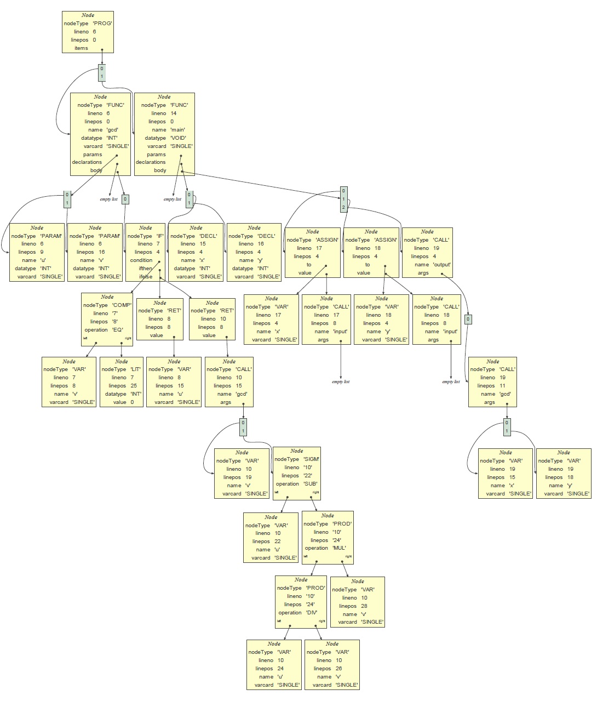

# C- Compiler

This is the final project made for my compilers class. It will compile C- to MIPS32.

It uses David Beazley's amazing Python implementation of Lex-Yacc: [Ply](https://www.dabeaz.com/ply/).

# Docs

- [What is C-?](docs/Lenguaje_C-.pdf) (Spanish)
- [User manual](docs/DocProyecto4.pdf) (Spanish)

# Running this thing
The main file you want to run is `compile.py`
```
usage: compile.py [-h] [-o output] [--AST] [--ST] source
C- to MIPS32 compiler.
positional arguments:
source Source C- file.
optional arguments:
-h, --help show this help message and exit
-o output Destination asm file.
--AST Show AST graphically. (Requires graphviz)
--ST Print symbol tables.
```

# What to do with ASM files?

I tested this using [QtSpim](http://spimsimulator.sourceforge.net/), a MIPS32 simulator.

It does account for delay slots, so it _should_ run on real hardware, but never had the chance to test.

# Samples
I added some samples in [samples/](samples/).

## Getting the Greatest Commond Divisor of Two Numbers
Source: [sample.cm](samples/sample.cm)

Compiled: [sample.asm](samples/sample.asm)

Produced Abstract syntax tree:


